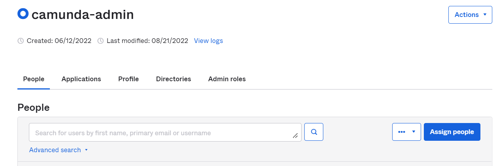
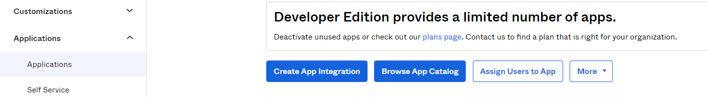
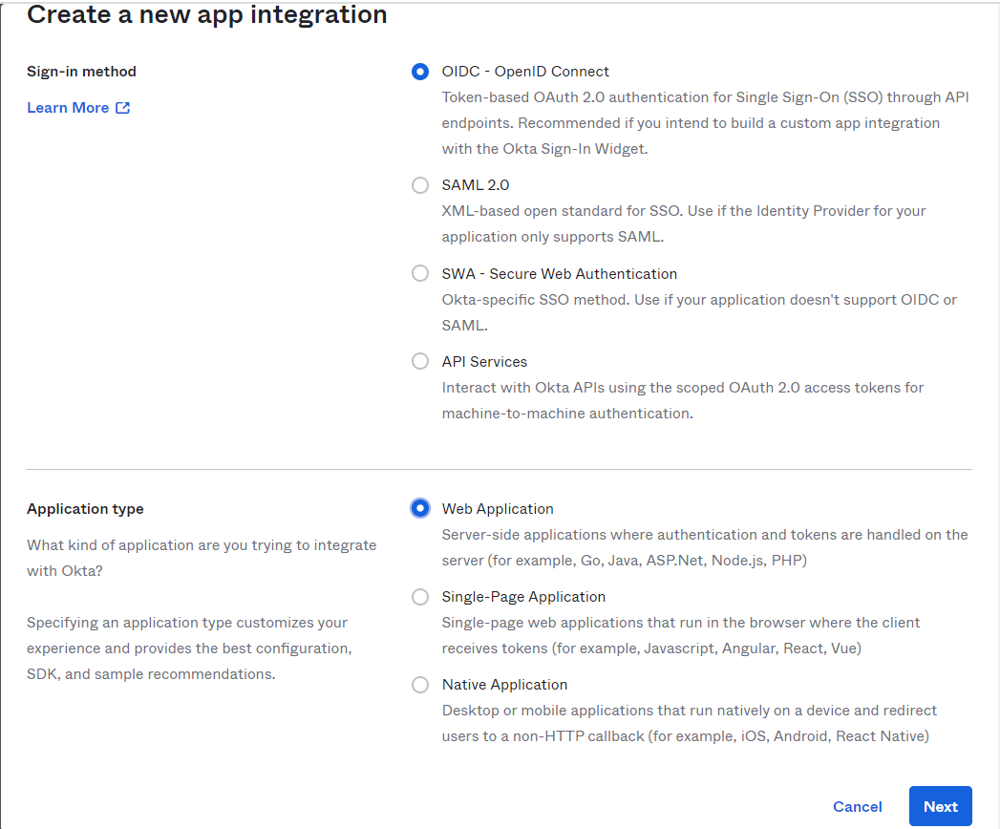
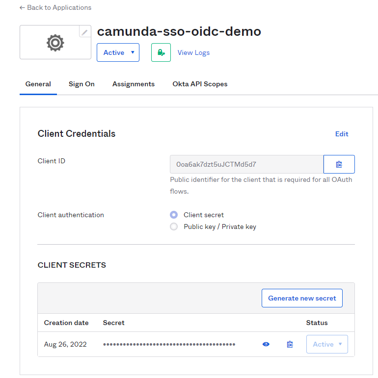
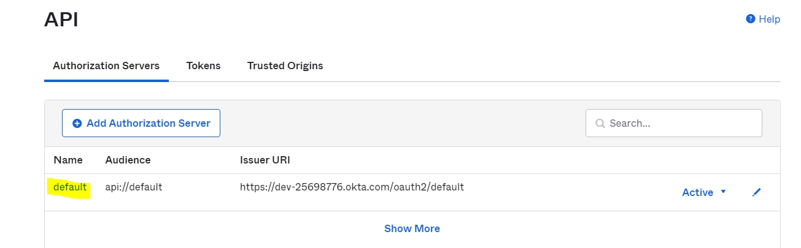
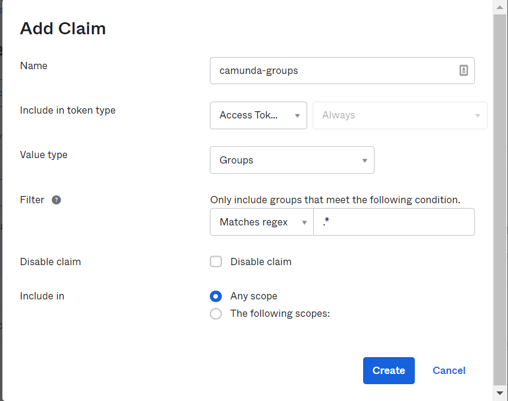
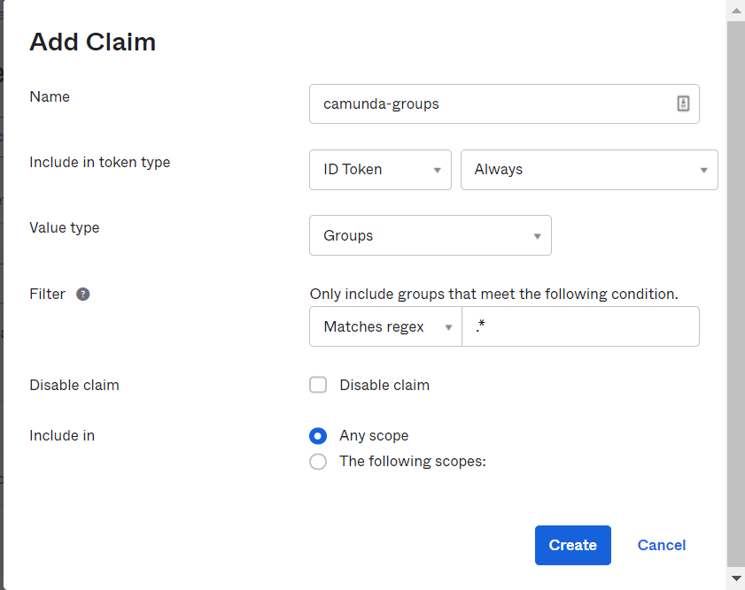
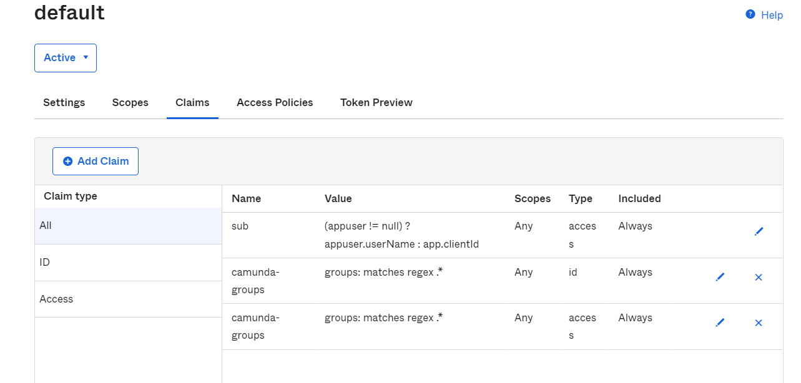

# Camunda Okta OIDC SSO 

# Based on Camunda 7.20 and Springboot 3.2 

The example to implement okta sso in Camunda for Oauth2.0 flow.

I have implemented Single logout as well in this. If you don't need then
modify the WebAppSecurityConfig .

Prerequisites
* Java 17
* Okta Developer Account
* Git

1. If you do not have free developer account on Okta then you can create one.
[Okta Developer Account](https://developer.okta.com/)

2. Login to your okta account and Register a group called "camunda-admin" and assign a user to it.

   Directory : Groups : Add group

3. Assign some people to group ( make sure you add few people via Directory : People)

5. Login to Okta and register your app by clicking on Applications : Create App Integration

6. Select OIDC and Application type as Web

7. Provide App Details

   App integration name (Whatever you like) : camunda-sso-oidc-demo
   
   Sign-in redirect URIs : http://localhost:8080/login/oauth2/code/okta

   Controlled Access : Everyone (You may change later)   

   Leave Every thing else default and Submit.

   Your app will look like this , Note down the Client ID and Client Secret

5. Creating Groups Claim 

Go to Security : Authorization Server : default 

 
Go To Claims Tab and create 2 claims with name "**camunda-groups**"  one for ID and one for access

Final Config will look like this.

8. Modify the application.yml and update following

   issuer: https://your-dev-tenant.okta.com/oauth2/default

   client-id: your okta client id here

   client-secret: your okta client secret here

   orgUrl: https://your-dev-tenant.okta.com

9. Run the Project with following commands

`./mvnw clean package`

`./mvnw spring-boot:run`

Open http://localhost:8080 in your favorite browser.

Now you will be taken to okta for login.

If you face some trouble, raise and issue on this repo.
